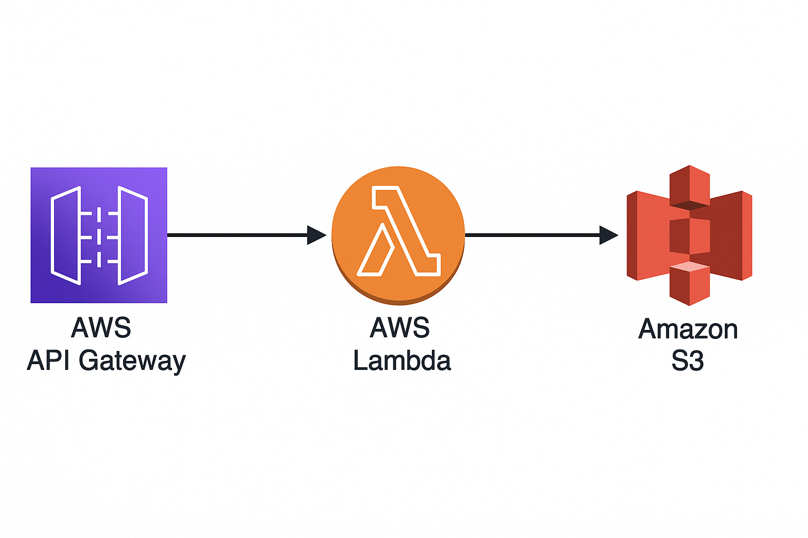

# MIAD RedPill Team ml-npl-projects
MIAD Machine Learning and Natural Processing language Repository for the projects.


# Project 1: Spotify Classification Model Setup 

This lambda permits a run a model to predic spotify classification model.




### Deploy locally with Docker locally
- Build docker image:

```shell
  docker buildx build --platform linux/amd64 --provenance=false -t ml-spotify-model-image:latest .
```

```shell
  docker run --name spotify --platform linux/amd64 -p 9000:8080 ml-spotify-model-image:latest
```

### Test with curl locally
```shell
curl -X POST http://localhost:9000/2015-03-31/functions/function/invocations \
  -H "Content-Type: application/json" \
  -d '{
    "version": "2.0",
    "rawPath": "/predict",
    "requestContext": {
      "requestId": "example-request-id",
      "http": {
        "method": "POST",
        "path": "/predict"
      }
    },
    "headers": {
      "Content-Type": "application/json"
    },
    "body": "{\"url\": \"https://example.com/song.mp3\", \"model_type\": \"classification\"}",
    "isBase64Encoded": false
  }'

```


### Testing  API Gateway with Curl 
- Consume the service with curl:

```shell
curl -X POST https://s0sw6sj5b6.execute-api.us-east-1.amazonaws.com/predict \
  -H "Content-Type: application/json" \
  -d '{\"url\": \"https://example.com/song.mp3\", \"model_type\": \"classification\"}'

```

### Terraform Configuration 

the project to create the infra is located on:
```shell
cd infrastructure/components/spotify
# To check the current infra
terraform init
```

### Create annaconda Enviroment

```shell

# Create
conda env create -f environment.yml
# To activate this environment, use
conda activate env-spotify
# To deactivate an active environment, use
conda deactivate

```


